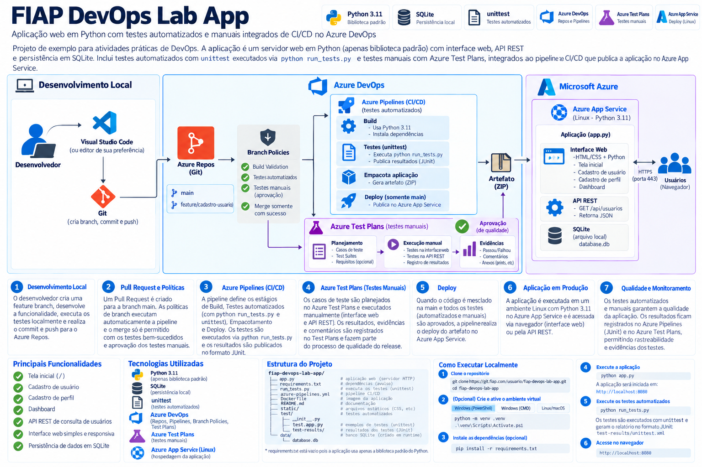

# FIAP DevOps Lab App

Aplicação web em **Python 3.11** criada para atividades práticas de DevOps utilizando **Git, Azure Repos, Azure Pipelines, Azure Test Plans, Branch Policies e Azure App Service**.

O projeto demonstra um fluxo completo de desenvolvimento, testes automatizados, testes manuais, integração contínua e deploy em ambiente Azure.

---

## Visão geral

A aplicação disponibiliza uma interface web simples para cadastro e consulta de usuários, além de uma API REST.

O projeto foi desenvolvido utilizando somente bibliotecas padrão do Python e possui persistência local utilizando **SQLite**.

O laboratório permite trabalhar conceitos como:

- versionamento com Git;
- feature branches;
- commits e push;
- Pull Requests;
- Branch Policies;
- testes automatizados;
- testes manuais com Azure Test Plans;
- publicação de resultados de testes;
- geração de artefatos;
- CI/CD com Azure Pipelines;
- deploy no Azure App Service.

---

## Arquitetura da solução



O fluxo da solução é dividido em desenvolvimento, validação e entrega.

```text
Desenvolvedor
     |
     v
Feature Branch
     |
     v
Azure Repos
     |
     v
Pull Request
     |
     +-------------------------------+
     |                               |
     v                               v
Azure Pipelines                 Azure Test Plans
Testes Automatizados            Testes Manuais
     |                               |
     +---------------+---------------+
                     |
                     v
                  Merge
                     |
                     v
                   main
                     |
                     v
              Azure Pipelines
                     |
              Build + Testes
                     |
                     v
                Artefato ZIP
                     |
                     v
              Azure App Service
                     |
                     v
                  Usuário
```

### Testes automatizados

Os testes automatizados são executados pela pipeline através do comando:

```bash
python run_tests.py
```

O `run_tests.py` utiliza o framework nativo:

```text
unittest
```

Os resultados são convertidos para o formato **JUnit XML**:

```text
test-results/unittest.xml
```

O Azure Pipelines publica esse arquivo utilizando a task:

```text
PublishTestResults@2
```

### Testes manuais

Os testes funcionais manuais são organizados utilizando **Azure Test Plans**.

No Test Plans podem ser criados:

```text
Test Plan
   |
   +-- Test Suite
          |
          +-- Test Case
          +-- Test Case
          +-- Test Case
```

Os casos de teste podem validar, por exemplo:

```text
Cadastro de usuário
Validação de campos obrigatórios
Validação de e-mail
Cadastro de e-mail duplicado
Consulta de usuários
Interface Web
API REST
```

Durante a execução manual podem ser registrados:

```text
Passed
Failed
Blocked
Comentários
Evidências
Screenshots
```

Dessa forma, o laboratório trabalha com dois tipos de validação:

```text
Testes Automatizados
Azure Pipelines
unittest
        +
Testes Manuais
Azure Test Plans
```

---

# Tecnologias utilizadas

| Tecnologia | Utilização |
|---|---|
| Python 3.11 | Desenvolvimento da aplicação |
| http.server | Servidor HTTP da aplicação |
| ThreadingHTTPServer | Processamento das requisições HTTP |
| SQLite | Persistência dos usuários |
| unittest | Testes automatizados |
| JUnit XML | Publicação dos resultados de testes |
| HTML | Interface Web |
| CSS | Estilização da interface |
| Git | Controle de versão |
| Azure Repos | Repositório Git do laboratório |
| Azure Pipelines | Pipeline CI/CD |
| Azure Test Plans | Testes manuais |
| Azure Branch Policies | Proteção da branch `main` |
| Azure App Service | Hospedagem da aplicação |
| Docker | Execução da aplicação em container |

---

# Funcionalidades da aplicação

A aplicação possui uma interface web para cadastro e consulta de usuários.

Principais funcionalidades:

```text
Tela inicial
Cadastro de usuário
Listagem de usuários
Validação de nome obrigatório
Validação de e-mail
Validação de e-mail duplicado
Health Check
API REST
Persistência em SQLite
```

---

# API REST

A aplicação disponibiliza os seguintes endpoints.

## Health Check

```http
GET /health
```

Exemplo de retorno:

```json
{
  "status": "ok",
  "service": "fiap-devops-lab"
}
```

---

## Listar usuários

```http
GET /api/users
```

Exemplo:

```json
[
  {
    "id": 1,
    "name": "Ana Souza",
    "email": "ana@example.com"
  }
]
```

---

## Consultar usuário por ID

```http
GET /api/users/1
```

Exemplo:

```json
{
  "id": 1,
  "name": "Ana Souza",
  "email": "ana@example.com"
}
```

---

## Cadastrar usuário pela API

```http
POST /api/users
```

Content-Type:

```text
application/json
```

Exemplo:

```json
{
  "name": "Ana Souza",
  "email": "ana@example.com"
}
```

Retorno esperado:

```json
{
  "id": 1,
  "name": "Ana Souza",
  "email": "ana@example.com"
}
```

---

# Estrutura do projeto

```text
fiap-devops-lab-app/
│
├── app.py
│
├── azure-pipelines.yml
├── Dockerfile
├── README.md
├── requirements.txt
├── run_tests.py
│
├── static/
│   └── app.css
│
├── tests/
│   └── test_app.py
│
├── test-results/
│   └── unittest.xml
│
└── docs/
    └── architecture.png
```

### Arquivos principais

| Arquivo | Responsabilidade |
|---|---|
| `app.py` | Aplicação Web, API REST e persistência SQLite |
| `run_tests.py` | Execução dos testes e geração do JUnit XML |
| `tests/test_app.py` | Casos de testes automatizados |
| `static/app.css` | Estilos da interface Web |
| `azure-pipelines.yml` | Pipeline CI/CD |
| `Dockerfile` | Construção da imagem Docker |
| `requirements.txt` | Dependências Python |
| `README.md` | Documentação do projeto |

---

# Pré-requisitos

Antes de executar o projeto, verifique se as seguintes ferramentas estão instaladas.

```bash
python --version
git --version
```

Versão recomendada:

```text
Python 3.11
Git
```

Opcionalmente:

```text
Visual Studio Code
Docker Desktop
Azure CLI
```

---

# Clonando o repositório

Clone o projeto:

```bash
git clone https://github.com/marcusmleite/fiap-devops-lab-app.git
```

Entre na pasta:

```bash
cd fiap-devops-lab-app
```

---

# Criando um ambiente virtual

O uso de um ambiente virtual é recomendado.

## Windows PowerShell

```powershell
python -m venv .venv
.\.venv\Scripts\Activate.ps1
```

## Windows CMD

```cmd
python -m venv .venv
.venv\Scripts\activate
```

## Linux / WSL / macOS

```bash
python3 -m venv .venv
source .venv/bin/activate
```

Após a ativação, o terminal poderá apresentar:

```text
(.venv)
```

---

# Instalando as dependências

Execute:

```bash
pip install -r requirements.txt
```

Atualmente o projeto não possui dependências externas.

O arquivo `requirements.txt` contém:

```text
# Sem dependências externas.
# A aplicação usa apenas biblioteca padrão do Python.
```

---

# Executando a aplicação

Execute:

```bash
python app.py
```

Por padrão a aplicação utiliza:

```text
http://localhost:8000
```

Abra no navegador:

```text
http://localhost:8000
```

O servidor escuta em:

```text
0.0.0.0:8000
```

---

# Variáveis de ambiente

A aplicação suporta algumas configurações através de variáveis de ambiente.

## PORT

Define a porta da aplicação.

Valor padrão:

```text
8000
```

Exemplo no PowerShell:

```powershell
$env:PORT="8080"
python app.py
```

Linux/WSL:

```bash
PORT=8080 python app.py
```

---

## DATABASE

Define a localização do banco SQLite.

Exemplo:

```powershell
$env:DATABASE="C:\temp\fiap.db"
python app.py
```

Linux/WSL:

```bash
DATABASE=/tmp/fiap.db python app.py
```

Se a variável não for informada, a aplicação utiliza um arquivo temporário chamado:

```text
fiap_devops_lab.db
```

---

## APP_VERBOSE

Habilita os logs HTTP do servidor.

PowerShell:

```powershell
$env:APP_VERBOSE="true"
python app.py
```

Linux/WSL:

```bash
APP_VERBOSE=true python app.py
```

---

# Executando os testes automatizados

Os testes utilizam o framework padrão do Python:

```text
unittest
```

Execute:

```bash
python run_tests.py
```

O script procura automaticamente os testes dentro de:

```text
tests/
```

Atualmente os testes estão em:

```text
tests/test_app.py
```

---

# Testes existentes

Os testes automatizados validam cenários como:

```text
Criação de usuário com sucesso
Nome obrigatório
E-mail inválido
Listagem de usuários
E-mail duplicado
Contrato básico do Health Check
```

Exemplo de execução:

```text
test_create_user_success ... ok
test_create_user_requires_name ... ok
test_create_user_rejects_invalid_email ... ok
test_list_users_after_create ... ok
test_duplicate_email_is_rejected ... ok
```

Ao final:

```text
Ran 6 tests

OK
```

---

# Resultado JUnit

Depois da execução:

```bash
python run_tests.py
```

é gerado o arquivo:

```text
test-results/unittest.xml
```

Esse arquivo é utilizado pelo Azure Pipelines para apresentar os resultados dos testes na interface do Azure DevOps.

Fluxo:

```text
tests/test_app.py
       |
       v
python run_tests.py
       |
       v
unittest
       |
       v
test-results/unittest.xml
       |
       v
PublishTestResults@2
       |
       v
Azure DevOps
Tests
```

---

# Executando com Docker

## Build da imagem

```bash
docker build -t fiap-devops-lab-app .
```

## Executar o container

```bash
docker run -p 8000:8000 fiap-devops-lab-app
```

Acesse:

```text
http://localhost:8000
```

O Dockerfile utiliza:

```dockerfile
FROM python:3.11-slim

WORKDIR /app

COPY . .

EXPOSE 8000

CMD ["python", "app.py"]
```

---

# Fluxo Git utilizado no laboratório

O desenvolvimento deve ser realizado utilizando feature branches.

Exemplo:

```bash
git switch -c feature/cadastro-usuario
```

Após realizar uma alteração:

```bash
git status
```

Adicionar os arquivos:

```bash
git add .
```

Criar o commit:

```bash
git commit -m "Implementa cadastro de usuario"
```

Publicar a branch:

```bash
git push -u origin feature/cadastro-usuario
```

Após configurar o upstream, os próximos envios podem utilizar:

```bash
git push
```

---

# Pull Request

Depois do desenvolvimento é criado um Pull Request:

```text
feature/cadastro-usuario
           |
           v
          main
```

O objetivo é evitar alterações diretamente na branch principal.

---

# Branch Policies

A branch `main` pode ser protegida utilizando políticas do Azure Repos.

Exemplo:

```text
Pull Request
      |
      v
Build Validation
      |
      v
Pipeline
      |
      v
Testes automatizados
      |
   +--+--+
   |     |
 Falha  Sucesso
   |     |
   v     v
Bloqueia Merge
 Merge
```

Configuração sugerida:

```text
Build pipeline:
Fiap-DevOps-Lab

Trigger:
Automatic

Policy requirement:
Required

Build expiration:
Immediately when main is updated
```

---

# Azure Test Plans

Além dos testes automatizados, o projeto utiliza **Azure Test Plans** para execução dos testes manuais.

O Test Plan permite organizar:

```text
Test Plan
   |
   +-- Test Suite
          |
          +-- Test Case
```

Um exemplo de organização poderia ser:

```text
FIAP DevOps Lab App

├── Cadastro de Usuário
│   ├── Cadastrar usuário válido
│   ├── Validar nome obrigatório
│   ├── Validar e-mail inválido
│   └── Validar e-mail duplicado
│
├── Interface Web
│   ├── Abrir página inicial
│   └── Visualizar usuários cadastrados
│
└── API REST
    ├── Consultar usuários
    ├── Consultar usuário por ID
    └── Cadastrar usuário
```

Durante a execução manual podem ser registradas evidências e resultados.

```text
Passed
Failed
Blocked
Not Applicable
```

O Azure Test Plans complementa os testes automatizados da pipeline.

```text
                    Qualidade
                       |
           +-----------+-----------+
           |                       |
           v                       v
Testes Automatizados         Testes Manuais
Azure Pipelines              Azure Test Plans
unittest                     Test Cases
           |                       |
           +-----------+-----------+
                       |
                       v
                  Aplicação
```

---

# Azure Pipeline

A pipeline está definida no arquivo:

```text
azure-pipelines.yml
```

O trigger principal é:

```yaml
trigger:
  branches:
    include:
      - main
```

Isso significa que alterações integradas na branch `main` iniciam automaticamente a pipeline.

---

# Etapa de Build e Testes

A pipeline utiliza:

```yaml
- task: UsePythonVersion@0
```

para selecionar:

```text
Python 3.11
```

Depois executa:

```bash
python -m py_compile app.py run_tests.py
```

para validar a sintaxe.

Em seguida:

```bash
python run_tests.py
```

executa os testes automatizados.

---

# Publicação dos testes

Os resultados são publicados através de:

```yaml
- task: PublishTestResults@2
```

utilizando:

```text
test-results/unittest.xml
```

A opção:

```yaml
failTaskOnFailedTests: true
```

faz com que testes com falha possam provocar falha na execução da pipeline.

---

# Geração do artefato

Depois dos testes, a aplicação é empacotada em um arquivo ZIP.

```text
fiap-devops-lab-app.zip
```

O artefato é armazenado pelo Azure Pipelines e posteriormente utilizado pelo estágio de deploy.

Fluxo:

```text
Código
  |
  v
Build
  |
  v
Testes
  |
  v
ZIP
  |
  v
Pipeline Artifact
```

---

# Deploy no Azure App Service

O deploy é realizado somente quando a pipeline está executando a branch:

```text
main
```

A condição utilizada é:

```yaml
eq(variables['Build.SourceBranch'], 'refs/heads/main')
```

O fluxo final é:

```text
feature
   |
   v
Pull Request
   |
   v
Testes
   |
   v
Merge
   |
   v
main
   |
   v
Pipeline
   |
   v
Build
   |
   v
Testes
   |
   v
Artefato
   |
   v
Deploy
   |
   v
Azure App Service
```

---

# Azure Service Connection

Para que o Azure DevOps possa publicar no Azure App Service é necessária uma **Service Connection**.

Fluxo:

```text
Azure DevOps
      |
      v
Service Connection
      |
      v
Azure Subscription
      |
      v
Resource Group
      |
      v
Azure App Service
```

No arquivo `azure-pipelines.yml` são utilizadas as variáveis:

```yaml
azureServiceConnection: 'sc-sc-fiap-azure-webapp'
webAppName: 'fiap-devops-lab-f1754'
```

Esses valores devem ser alterados quando o projeto for utilizado em outra assinatura ou ambiente Azure.

---

# Azure App Service

A aplicação é publicada em um:

```text
Azure App Service
Linux
Python 3.11
```

A task utilizada pela pipeline é:

```yaml
AzureWebApp@1
```

O comando de inicialização configurado é:

```text
python app.py
```

---

# Fluxo completo do laboratório

```text
Azure Boards
     |
     v
Planejamento
     |
     v
Feature Branch
     |
     v
Desenvolvimento
     |
     v
Testes Locais
python run_tests.py
     |
     v
Commit
     |
     v
Push
     |
     v
Azure Repos
     |
     v
Pull Request
     |
     +---------------------------+
     |                           |
     v                           v
Azure Pipelines            Azure Test Plans
Testes Automatizados       Testes Manuais
     |                           |
     +-------------+-------------+
                   |
                   v
                 Merge
                   |
                   v
                  main
                   |
                   v
             Azure Pipelines
                   |
                   v
             Build + Test
                   |
                   v
              Artefato ZIP
                   |
                   v
                 Deploy
                   |
                   v
          Azure App Service
                   |
                   v
                Usuários
```

---

# Objetivo educacional

O objetivo deste projeto é permitir que o aluno vivencie um fluxo DevOps próximo de um cenário real, integrando planejamento, desenvolvimento, controle de versão, revisão de código, testes automatizados, testes manuais e entrega contínua.

Ao final do laboratório, o aluno deverá compreender a relação entre:

```text
Azure Boards
Azure Repos
Azure Pipelines
Azure Test Plans
Branch Policies
Azure App Service
```

e como esses serviços podem ser utilizados em conjunto durante o ciclo de desenvolvimento de software.

---

## Repositório

```text
https://github.com/marcusmleite/fiap-devops-lab-app
```

## Autor

**Marcus Martins Leite**

Projeto desenvolvido para atividades práticas de DevOps e Cloud.
